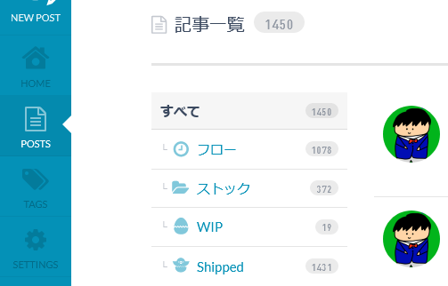

# esa7th Anniversary とのこと

といってもポスト時点では 1 日過ぎていますが、とてもめでたいです\\( ⁰⊖⁰)/。

去年も同じようなことを書きました。 [esa 6th Anniversary とのこと](https://yutagoto.github.io/blog/20200511-esa-6th-anniversary-%E3%81%A8%E3%81%AE%E3%81%93%E3%81%A8/)

esaが個人で使ったり [mitakarb](https://mitakarb.doorkeeper.jp/) で使ったりしています。esa日記もちまちま続いています。  [esaで日記をつけている](https://yutagoto.github.io/blog/20190514-esa%E3%81%A7%E6%97%A5%E8%A8%98%E3%82%92%E3%81%A4%E3%81%91%E3%81%A6%E3%81%84%E3%82%8B/)

おかげさまで個人のポストも増えてきました。去年の倍くらいにですかね。esa日記や日々解いているAtCoderの問題の振り返りを残しているだけあってめちゃくちゃ記事数が伸びています。

↑画像: 地味に去年とUIが変わっていることに気がついた

そんな感じに個人esaを運用していますが、今年はDiscordに記念サーバーが立ち上がりました！

<blockquote class="twitter-tweet">
【お知らせ】 diary/2021/05/10/esaが誕生7周年 :tada: :birthday: :esa2: <a href="https://t.co/OO6gRljTDL">https://t.co/OO6gRljTDL</a> <a href="https://twitter.com/hashtag/esa_io?src=hash&amp;ref_src=twsrc%5Etfw">#esa_io</a> <a href="https://twitter.com/hashtag/%EF%BE%84%EF%BE%89%EF%BD%BA%EF%BE%84?src=hash&amp;ref_src=twsrc%5Etfw">#ﾄﾉｺﾄ</a>
&mdash; esa_io (@esa_io) <a href="https://twitter.com/esa_io/status/1391623368017776643?ref_src=twsrc%5Etfw">May 10, 2021</a></blockquote>

といっても特段パーティをするわけでもなくゆるゆるとおしゃべりをするという内容でした。めちゃくちゃ楽しかったです！

---

これからも個人、コミュニティともによろしくお願いします！

<blockquote class="twitter-tweet" data-conversation="none">
ケーキを作って各家庭に届けてくださったのは今年も <a href="https://twitter.com/bonsweets?ref_src=twsrc%5Etfw">@bonsweets</a> さん&quot;(\( ⁰⊖⁰)/)&quot; かわいくておいしいケーキありがとうございます🎂 <a href="https://t.co/hTz9gjDYHJ">pic.twitter.com/hTz9gjDYHJ</a>
&mdash; taea🐶 (@ken_c_lo) <a href="https://twitter.com/ken_c_lo/status/1391648347212050434?ref_src=twsrc%5Etfw">May 10, 2021</a></blockquote>

esaケーキおいしそう。。。
