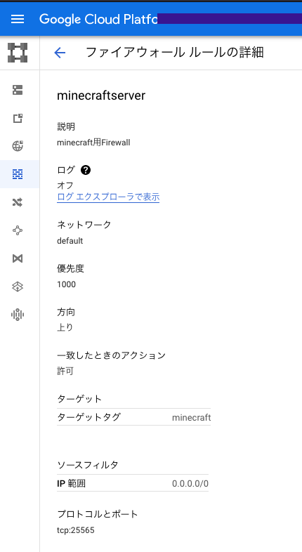
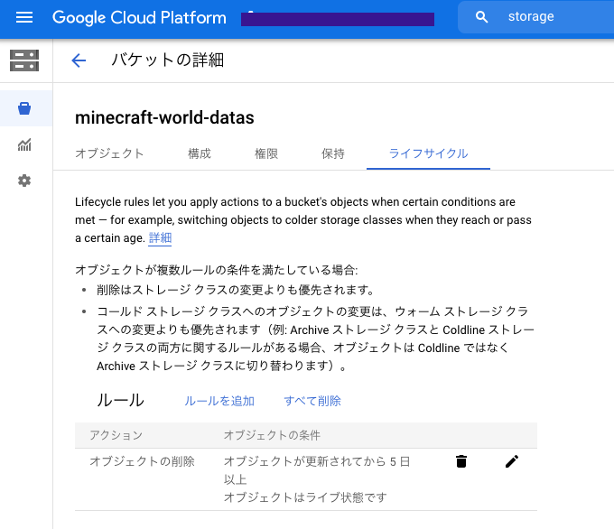
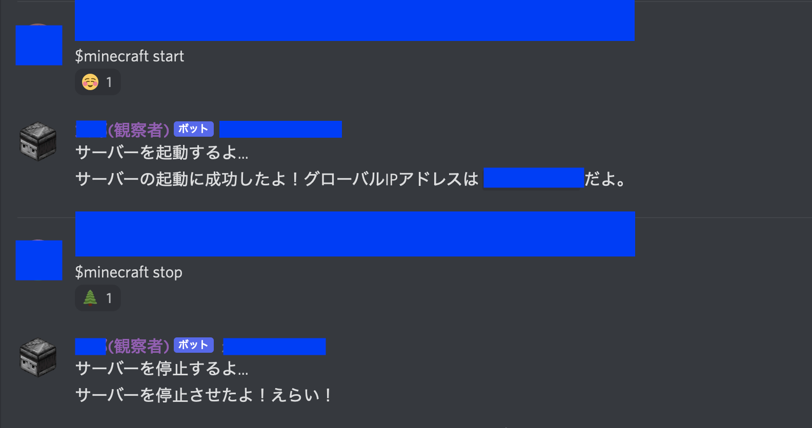
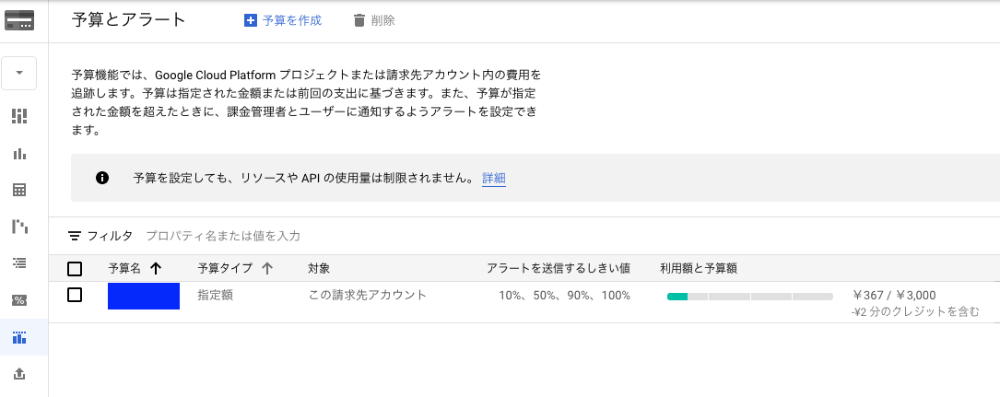
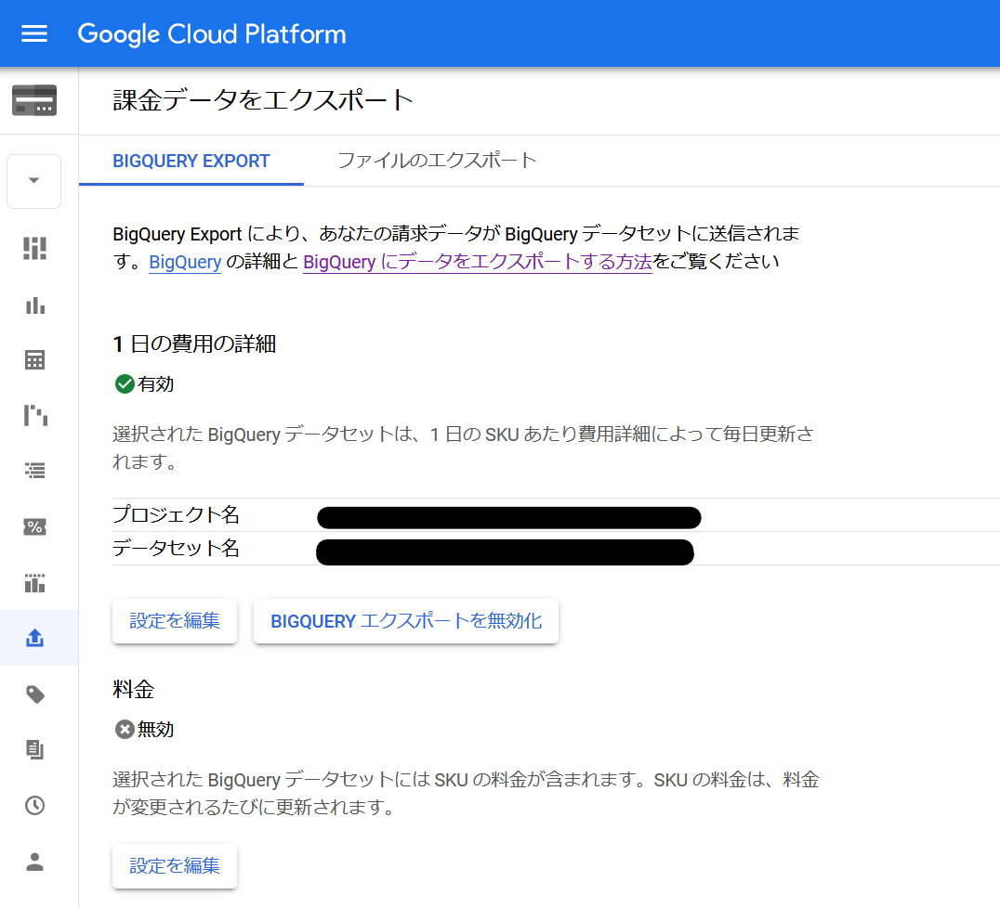
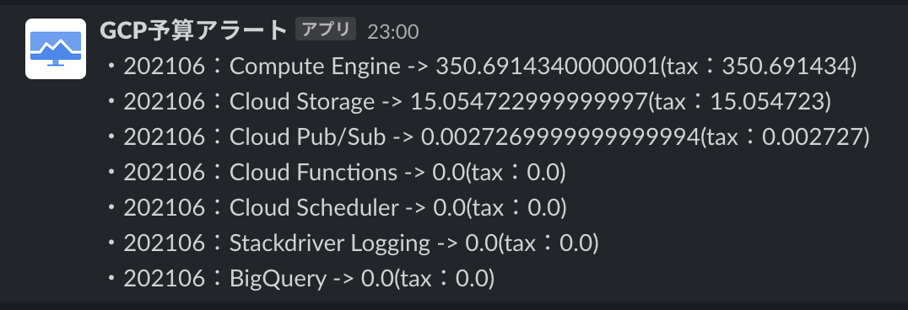

こんにちは、.ごっちです。

ちょっと前(2021年4月くらい)から友人にお願いされて[Minecraft](https://www.minecraft.net/ja-jp)(Java Edition)のサーバーの面倒をみることになりました。
もともとは[ConoHa VPSのMinecraftプラン](https://www.conoha.jp/vps/function/minecraft/)を使っていたとのことでしたが、もろもろ事情があって作れないか？とのことでした。
同じくConoHa VPSサーバーを使ってもよかったんですが、クラウドの勉強も兼ねて[GCP](https://cloud.google.com/)上で環境を整えることにしました。

## GCEたてる

さくっと作りたかったので[Google Compute Engine](https://cloud.google.com/compute)上にUbuntu(18.04)をいれてサーバーを立てました。スペックは以下の通り

- マシンタイプ: e2-standard-2（vCPU x 2、メモリ 8 GB）
    - ~~e2-small(vCPU x 2, メモリ 2GB)~~ で最初作って動かしたところ、マインクラフトが途中でクラッシュしてしまいました..
- ゾーン: asia-northeast1-b
    - いわゆる東京リージョン
- ブートディスク: 10GB

複数人で同時に遊ぶ前提もあるので、そこそこなマシンタイプになっています。たぶん20人くらいまで同時にプレイしても問題ないはずです。まだそういう状況になっていないので本当に耐えられるのかは未検証ですが、6－7人同時接続プレイはほぼ問題なく動作しました。

### サーバーの細かな設定

http, https通信は不要なのでファイアウォールの設定から塞いでおきます。Minecraftにつなげるために 25565番ポートを開けておきます。VPCネットワークのファイアウォールルールでルールを作って、そのタグを付与させます。



## 環境構築

公式Wikiにあるチュートリアルの通りに進めました。かなり親切だと思います。

https://minecraft.fandom.com/ja/wiki/%E3%83%81%E3%83%A5%E3%83%BC%E3%83%88%E3%83%AA%E3%82%A2%E3%83%AB/%E3%82%B5%E3%83%BC%E3%83%90%E3%83%BC%E3%81%AE%E3%82%BB%E3%83%83%E3%83%88%E3%82%A2%E3%83%83%E3%83%97

## ワールドの引っ越し

もともと運用されていたConoHa上にあるワールドデータをGCE上に移動させます。

ConoHaにあるワールドデータを`tar.gz`に固めて自身の端末にダウンロードします。そのファイルをGoogleCloudStorageで作ったバケットにアップロードします。

GoogleCloudStorageのバケットにアップロードしたファイルをGCEにダウンロードして展開します。初回起動時に自動生成されたワールドデータは削除しておきます。

```sh
minecraft $ rm -rf world # 現ワールドを消す
minecraft $ gsutil cp gs://バケット名/ファイル名.tar.gz . # GCEからGCSに繋げられるようにサービスアカウントの設定をしておく
minecraft $ tar -zxvf ファイル名.tar.gz
minecraft $ cp 展開したworldディレクトリ名 world
```

展開までできたら起動して動作確認をします。

```sh
minecraft $ java -Xmx1024M -Xms1024M -jar server.jar nogui
```

実際に繋げて確認します。データの損失がないこと確認して、データの保存がしっかりと行われていれば完了です！

## 追加機能

せっかく自由に管理できる状態なので、より安心して遊びやすくしていきます。

### ワールドデータのバックアップ

不慮の事故でデータやサーバが損失したとしても もとに戻せるようにバックアップをサーバ起動時にとっておきます。起動と同時(`crontab` で設定します)にディレクトリを圧縮してGCSにアップロードするスクリプトを実行しているだけです。

```sh
#!/bin/bash
cd ~/minecraft
tar czf world.tar.gz world
gsutil cp -R ~/minecraft/world.tar.gz gs://バケット名/$(date "+%Y%m%d%H%M%S")-world.tar.gz
rm world.tar.gz
cd ~
```

バックアップデータも永遠に保持する必要もないので(保持していたらその期間分お金が発生してしまいますし)、GCSのライフサイクルの設定で5日間経過したら削除するようにしました。



### Discordから起動・停止できるように

24時間起動させておく必要はないので、遊びたくなったら起動・終わったら停止がDiscordからできるようにつくります。サーバが起動したらMinecraftも自動で起動するようにしておきます。(`crontab` で設定します)

Pythonのスクリプトをサクッと書きました。

[Qiita](https://qiita.com/thinceller/items/6bc7d28a04a8da75e818)の記事が大変参考になりました。

いまはheroku上に24時間 Free Dynosでぶいぶい起動させていますが、ゆくゆくは[スラッシュコマンド](https://blog.discord.com/slash-commands-are-here-8db0a385d9e6)で実装し直したいと考えています。Herokuを脱却してできればCloudRunとかにのせたいと企んでいます。

使い勝手は以下の画像のようになっています。



停止しわすれたときのために自動でシャットダウンする機能もつくりたいとも考えてますが、いい感じの実装が思いついていないです。

### 料金通知

長時間起動していなければそこまで大きな課金額にならないと踏んでいますが、莫大な請求金額になる前に気づきたいので、毎日その時点での月の請求金額を通知する仕組みも用意しています。

予算設定もあるので、課金額が予算額に達したらスマホ通知やメール通知が飛ぶように設定します。



課金データはBigQueryに出力できるのでやっておきます。



あとは定期的にBigQueryを叩いて、(普段 仕事でも使う)Slackに通知が飛ぶように仕向けます。

実行自体はCloudFunctionで定期的な実行フラグはSchedulerで間をつなぐのはPub/Subでやっています。

いまのところその予算を超えるような使い方をしていないのでかなり平和で安く運用できています。



小数が適切に処理されていないのは見逃してほしいです。。

## 今後

[Game Servers](https://cloud.google.com/game-servers)というKubernetes上でもろもろ管理・スケールできるものもあるんですが、ソシャゲでスペック調整いるとか24時間管理するものとかでもないのでいったん見送っています。

すぐに環境を用意できて削除することもできることが分かったので、突発企画で建築コンペやダイヤ発掘レース・マルチでエンダードラゴン討伐TAなどもできそうだなーとか思っています。要望があれば作ります。

前述した実装しきれていない部分もあるので時間を見つけて着手していきます。

こんな感じのことをやっていると、Minecraftそのものをプレイする時間がなくなってきます(´・ω・｀)

<blockquote class="twitter-tweet"><p lang="ja" dir="ltr">いじいじ <a href="https://t.co/NrUuYzdn4O">pic.twitter.com/NrUuYzdn4O</a></p>&mdash; .ごっち (@gggooottto) <a href="https://twitter.com/gggooottto/status/1383101215953752065?ref_src=twsrc%5Etfw">April 16, 2021</a></blockquote>
