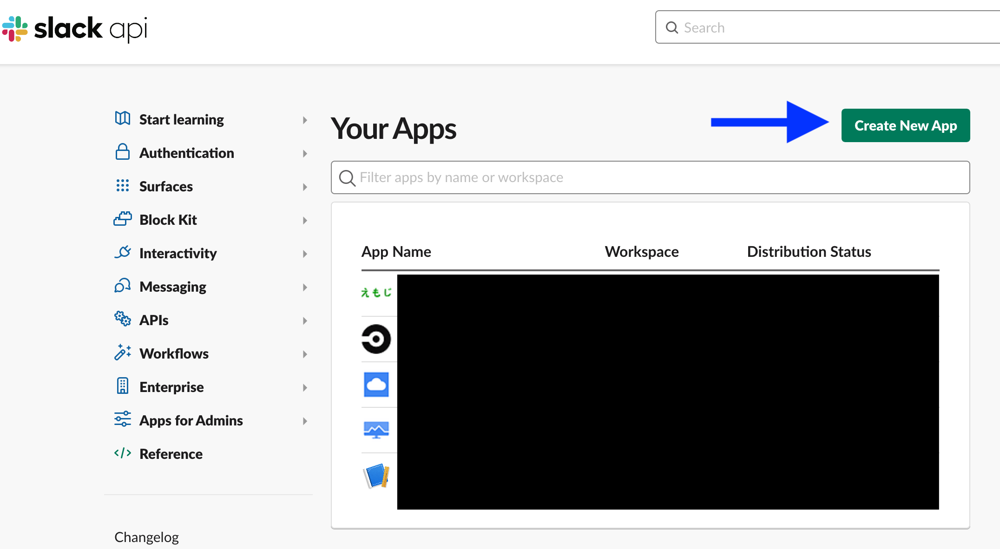
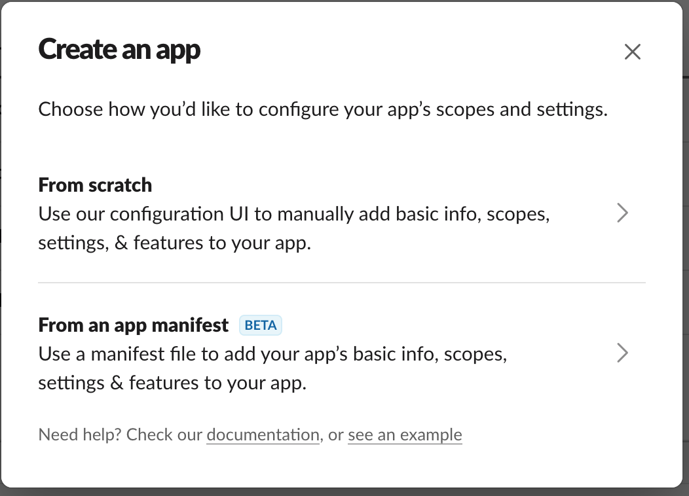
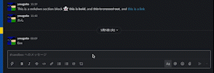

この記事は[雑談 Slack Advent Calendar 2021](https://adventar.org/calendars/6233) の 3 日目の記事です。

こんにちは、.ごっちです。
毎年雑談 Slack アドベントカレンダーで Slack emoji について取り上げているような気がしていますが、今年も取り上げます。

- [2020: emojicode CircleCI](https://dev.to/yutagoto/emojicode-circleci-5egn)
- [2019: emojicode FizzBuzz](https://dev.to/yutagoto/emojicode-fizzbuzz-4akl)
- [2018: Emoji でいっぱい](https://medium.com/@gggooottto/emoji%E3%81%A7%E3%81%84%E3%81%A3%E3%81%B1%E3%81%84-a8f63d02ebb1)
- [2017: Emoji でいっぱい](https://medium.com/@gggooottto/emoji%E3%81%A7%E3%81%84%E3%81%A3%E3%81%B1%E3%81%84-f5bcca95c24)

SlackSlashCommand を送信したら、ランダムに絵文字を返してくれる機能を試しに作りました。

## Slack アプリの登録

[公式のドキュメント](https://api.slack.com/authentication/basics)を見ながら作成します。

https://api.slack.com/apps にアクセスして、 `Create New App` から `From Scratch` を選択して登録します。






登録し終えたら `App Manifest` を編集します。
今回は `botの有効化`, `emojiの取得`, `slash commands`, `チャットの書き込み` ができるようにします。

また、同じ Manifest で slash コマンドの登録もできるので合わせて設定します。
Manifest の詳しい仕様は[公式ドキュメント](https://api.slack.com/reference/manifests)を見たほうが早いです。

```yaml
_metadata:
  major_version: 1
  minor_version: 1
display_information:
  name: emoji-sample
features:
  bot_user:
    display_name: emoji-sample # slackに表示するbotの名前
    always_online: true
  slash_commands:
    - command: /emojigacha # コマンド名
      url: # ngrokを使ってデバッグすると楽
      description: emoji gacha
      usage_hint: /emojigacha
      should_escape: false
oauth_config:
  scopes:
    bot:
      - chat:write
      - emoji:read
      - commands
settings:
  org_deploy_enabled: false
  socket_mode_enabled: false
  token_rotation_enabled: false
```

ここまでできたらインストールしたい Slack のワークスペースにインストールします。
インストールできたら `OAuth & Permissions` ページに移動して、 `Bot User OAuth Token` を取得します。

また、 `Basic Information` ページにある `Verification Token` も取得しておきます。
ここまでできたら Slack 側の準備完了です。

## コード

Slash コマンドが実行されたときの処理を書きます。 今回は `Python`, `flask`, `slack_sdk` を使います。

- https://palletsprojects.com/p/flask/
- https://slack.dev/python-slack-sdk/

プロジェクトのコードは GitHub にあげていますので、それも見てください。

https://github.com/YutaGoto/emoji-gacha

12 行目にある if 文は、本当に slack の slash コマンドから POST されたものかのチェックをするための分岐です。

```py
@app.route('/emoji-gacha', methods=['POST'])
def emoji_gacha():
    if request.form['token'] == config.VERIFICATION_TOKEN:
```

13 行目にある `emoji_list()` で絵文字一覧を取得します。 仮に emoji 以外になにか取得する場合にもそれぞれメソッドが用意されているので、かなり便利に使用できます。ただ、使用する場合はそれに応じた manifest の編集が必要です。

https://api.slack.com/methods

```py
res = slack_client.emoji_list()
```

## 動作確認

開発環境での検証は `ngrok` を使うと楽です。詳しくは書きません。

https://ngrok.com/

flask サーバーを起動して ngrok を起動して、その URL を manifest に書き込んだらテストをします。
以下のように slack 上で slash コマンドを入力できて、BOT がワークスペースに登録された emoji を 1 つだけチャットされます。



AWS lambda などにデプロイすれば、いつでも emoji ガチャを回すことができます！
