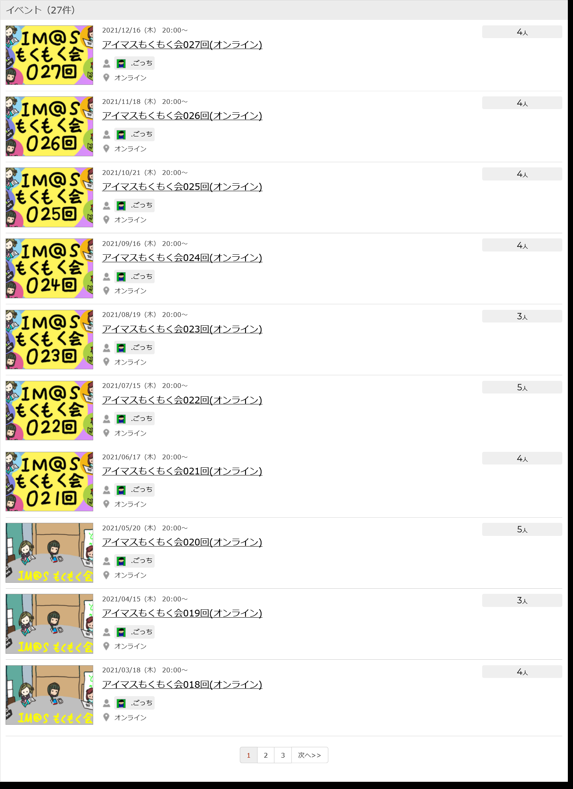
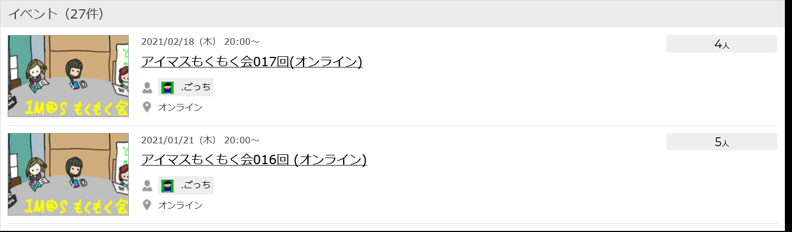

こんにちは、 .ごっちです。

2019 年夏くらいから始めたアイマスもくもく会ですが、2021 年現在も続けています。去年分は IM@S ENGINEERS ON@IR!!!! 2020 で発表しているのでそちらを見てください。

<iframe width="560" height="315" class="speakerdeck-iframe" style="border: 0px none; background: rgba(0, 0, 0, 0.1) none repeat scroll 0% 0% padding-box; margin: 0px; padding: 0px; border-radius: 6px; box-shadow: rgba(0, 0, 0, 0.2) 0px 5px 40px;" src="https://speakerdeck.com/player/2b53885e180b4c759f815a36cd66ccdf" title="アイマスエンジニアもくもく会を約1年続けているお話" allowfullscreen="true" mozallowfullscreen="true" webkitallowfullscreen="true" data-ratio="1.78343949044586" frameborder="0"></iframe>

<iframe width="560" height="315" src="https://www.youtube.com/embed/vbxanH0neQU?start=2043" title="YouTube video player" frameborder="0" allow="accelerometer; autoplay; clipboard-write; encrypted-media; gyroscope; picture-in-picture" allowfullscreen></iframe>

https://yutagoto.github.io/blog/20200927-im-s-engineers-on-ir-2020%E3%81%A7%E7%99%BA%E8%A1%A8%E3%81%97%E3%81%9F/

## 2021 年もくもく会総括

毎月開催できました！

2021 年はだいたい毎月第 3 木曜日開催していました。昨年末のアンケート結果を踏まえて曜日をずらしての開催となりました（2020 年は水曜日開催でした）。

https://imastudy-mokumoku.connpass.com

2021 年も相変わらずの情勢なので、すべてオンライン開催となりました。9 月まで NeWork、10 月から Twitter Spaces でのもくもく会となりました。

### Twitter Spaces 開催

NeWork のような閉じた空間ではなくオープンな開催にしても問題ない判断して、だれでも気軽に(とくに Connpass で参加表明をしていなくても)参加できるようにサービスを変更しました。

https://github.com/imas/mokumoku/blob/main/meetups/kanto/024/kpt.md

実際に飛び入り参加が何回かあったので正解かと思っています。

<blockquote class="twitter-tweet">
やるぞ! <a href="https://twitter.com/hashtag/imas_mokumoku?src=hash&amp;ref_src=twsrc%5Etfw">#imas_mokumoku</a><a href="https://t.co/4IaU07lhnD">https://t.co/4IaU07lhnD</a>
&mdash; .ごっち (@gggooottto) <a href="https://twitter.com/gggooottto/status/1471434954022453251?ref_src=twsrc%5Etfw">December 16, 2021</a></blockquote>

### Connpass ヘッダー

もともとの Connpass のヘッダー画像はオフラインを意識して、みんなで集まって大きいテーブルに向かってもくもくするをイメージしていましたが、オンライン開催に変わって物理的なテーブルに集まってすることがなくなってしまったので NeWork のデザインを意識して変更した次第です。

↓

## 2021 年もくもく会成果

2021 年もたくさんの成果がありました。参加してくださったプロデューサーさん ありがとうございました！

- IM@Sparql データ整備・追加・レビュー
- IM@Sparql の破壊的変更の影響範囲調査
  - https://space.pikopikopla.net/query/1a823d410c
- What3Idols
  - https://what3idols.vercel.app/
- プロデューサー名刺交換アプリ
- cluster.mu の 765 プロライブ劇場の調整
  - https://cluster.mu/w/92458ea4-6424-44c8-8833-33491ceccd5a
- デスクトップでアイドルを動かす
  - https://imastodon.net/@banjun/105589131883059787
- M1 mac 対応
- デレステの楽曲情報まとめ
  - https://www.slideshare.net/maraigue/mv3-153914414 もともと
  - 例えば「【アイドル名】と一緒に曲をよく歌っているのは【アイドル名】」とかが計算できるようになりたい
- im@sparql から引いてきた色を、macOS の標準のカラーピッカーで使えるようにする
  - https://github.com/banjun/colorlist-imasparql
- imasbook 検討、調査
- 論文を読む
  - `モバイルゲームにおける女性キャラクターの魅力的要素の分析`
  - https://www.jstage.jst.go.jp/article/jsik/31/2/31_2021_023/_article/-char/ja
- im@s-palette
  - https://imas-palette.vercel.app/
- PhotoStudioPlayer の Xcode13 対応
  - https://github.com/banjun/PhotoStudioPlayer
- Deno でへんなサイトを作る。メンテする。
  - https://morino.deno.dev/
- アイドルマスターシャイニーカラーズ の非公式専用ブラウザメンテ
  - https://www.arrow2nd.com/works/serizawa
- Swift Playground for iPad を使う
  - https://twitter.com/banjun/status/1471462602836692997

## 今後

2022 年以降 まだまだ先行き不透明なので引き続きオンライン開催の予定です。また、もくもくしたい内容がないともくもくする人は増えないので、イベントページにあるもくもく内容の例示やとっかかりをもうちょっと充実させたいところです。

引き続きもくもくやっていきますので、よろしくお願いします！
