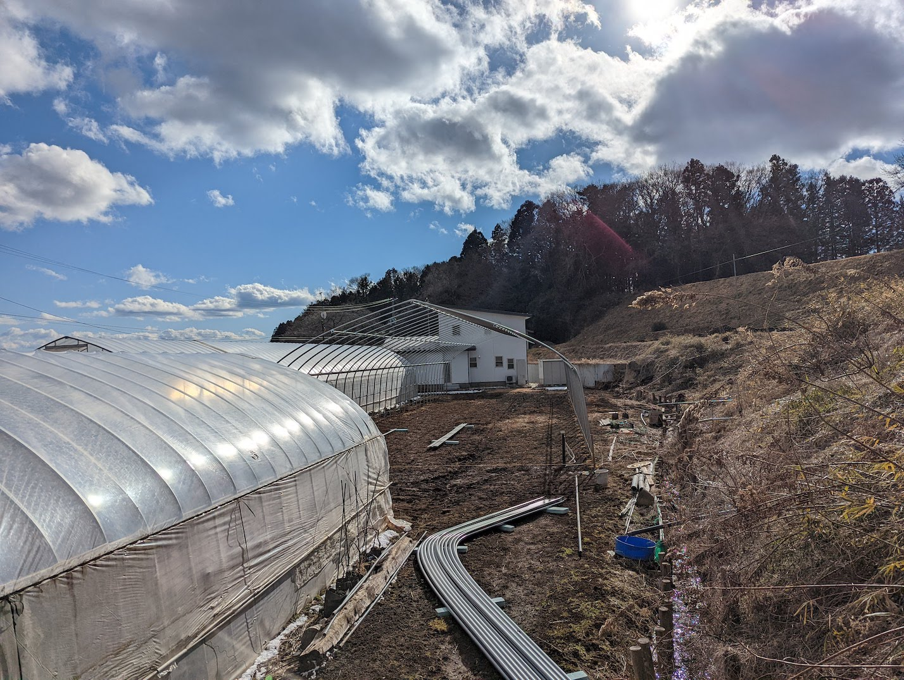
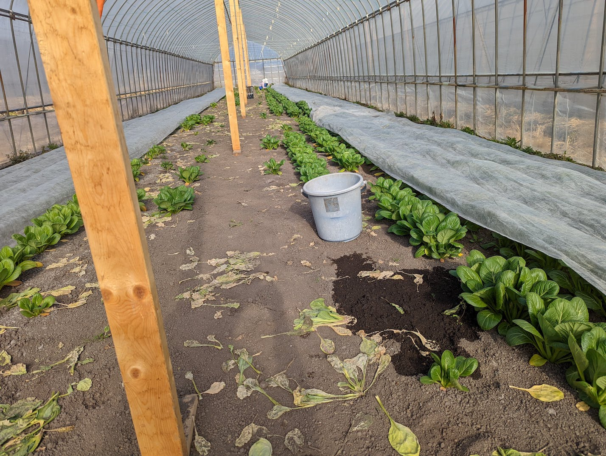
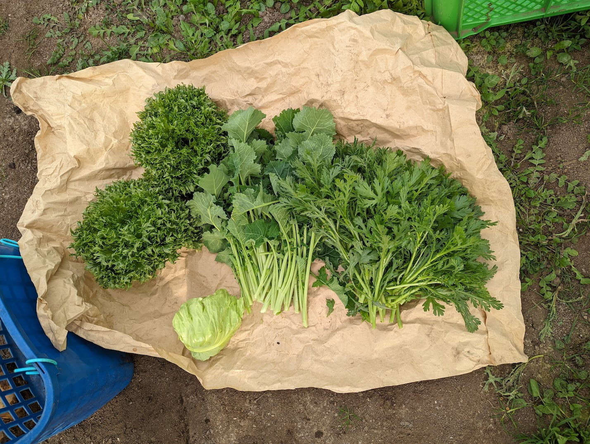

こんにちは、.ごっちです。

ひょんなことから2月の半ばから終わりくらいまで福島県にある農家さんのお手伝いに行ってました。(2021年8月に続いて2回目のお手伝いです)

## 手伝った内容

### ハウス建て

新品のパイプを使ってビニールハウスを建てます。よく見るビニールハウスのだいたい1.8倍くらいの大きさらしいです。めちゃくちゃでかいです..。

<blockquote class="twitter-tweet">
今日なんか届いたぞい！ <a href="https://t.co/llbowG9e4d">pic.twitter.com/llbowG9e4d</a>
&mdash; いなづま (@inaduma) <a href="https://twitter.com/inaduma/status/1494987874848362497?ref_src=twsrc%5Etfw">February 19, 2022</a></blockquote>

資材ひとつひとつが大きく重いのも相まって、パイプを起こしたり高さを調整したり梁を通したりなどは通常のハウス組み立て作業よりも力のいる作業でした。ハウスの組み立て作業自体初めての経験なのでなんとも比較できませんが..。

<blockquote class="twitter-tweet">
【おはよう毎日つむぐ】2月19日(土) #343 お手伝いつむぐ☺️ お友達の農家さんが新しく建てるビニールハウスのパイプ立てを手伝いました☺️ ビニールハウスってこうやって立てていくんですねー☺️手伝った代わりにつむぐ用に野菜作ってくれるって☺️何を作ろうかなー<a href="https://twitter.com/hashtag/%E3%81%8A%E3%81%AF%E3%82%88%E3%81%86Vtuber?src=hash&amp;ref_src=twsrc%5Etfw">#おはようVtuber</a> <a href="https://twitter.com/hashtag/%E3%81%A4%E3%82%80%E3%81%90%E5%A4%A7%E8%B0%B7%E3%81%95%E3%82%93?src=hash&amp;ref_src=twsrc%5Etfw">#つむぐ大谷さん</a> <a href="https://t.co/6QyliESMSo">pic.twitter.com/6QyliESMSo</a>
&mdash; 大谷つむぐ👒東P-01a(2日目) (@neko_ta23) <a href="https://twitter.com/neko_ta23/status/1495041302920003589?ref_src=twsrc%5Etfw">February 19, 2022</a></blockquote>

滞在期間中のほとんどが雪で一層寒かったり地面がぬかるんだりしてかなり大変ではありましたが、高さを調整して梁を通すとかなりきれいなハウスの骨組みとなり気持ちがいいものです。

ドア面を組み立てる作業やビニールをかぶせる作業までは期間がなくお手伝いできませんでしたが、雪が降る中完成手前までお手伝いできたのはよかったかと思います。

### 小松菜の収穫

出荷する用の小松菜を収穫しました。

ひとつひとつ切って形を整えています。整えた結果スーパーでよく見るあの小松菜になります。

### ブロッコリー苗の仮植

小さいポットに植えたブロッコリーの芽を土ごと大きいポットに植え移します。

<blockquote class="twitter-tweet">
ブロッコリー <a href="https://t.co/2GcCsgUFLM">pic.twitter.com/2GcCsgUFLM</a>
&mdash; .ごっち (@gggooottto) <a href="https://twitter.com/gggooottto/status/1497009361629364224?ref_src=twsrc%5Etfw">February 25, 2022</a></blockquote>

自分自身、ブロッコリーは成ったあの形 🥦 しか知らないので、芽がいかにも普通な点で逆に新鮮です。

## そのほか

### 野菜

出荷・収穫しきれなかったレタスや春菊などを採って、サッとゆでておひたしにして頂いたりしました。採れたてということには変わりないのでめちゃくちゃ新鮮でうまかったです。

<blockquote class="twitter-tweet">
レタスを収穫する人 <a href="https://t.co/hDIMv4E9I8">pic.twitter.com/hDIMv4E9I8</a>
&mdash; .ごっち (@gggooottto) <a href="https://twitter.com/gggooottto/status/1495392762287378433?ref_src=twsrc%5Etfw">February 20, 2022</a></blockquote>

### 通常の仕事

東京の自宅にいなくてもインターネットがつながる環境にあれば仕事をできるので、開発業もちゃんとやっていました。Webミーティングもこなしています。

<blockquote class="twitter-tweet">
東京にいなくてもちゃんと仕事ができるのがよい。。（よい）
&mdash; .ごっち (@gggooottto) <a href="https://twitter.com/gggooottto/status/1496646934685110273?ref_src=twsrc%5Etfw">February 24, 2022</a></blockquote>

### 夜

周りに(歩いて行く範囲に)街がなく畑・田んぼしかないので、夜はかなり暗いです。その分、晴れていたら星がはっきりと見えました。

<blockquote class="twitter-tweet">
<a href="https://t.co/42VTAI0H9I">pic.twitter.com/42VTAI0H9I</a>
&mdash; .ごっち (@gggooottto) <a href="https://twitter.com/gggooottto/status/1496107374515728384?ref_src=twsrc%5Etfw">February 22, 2022</a></blockquote>

スマホカメラのナイトモード撮影でもオリオン座がそれなりに写ります。

## このあと

収穫時期になったら、またお手伝いにいく予定です。
