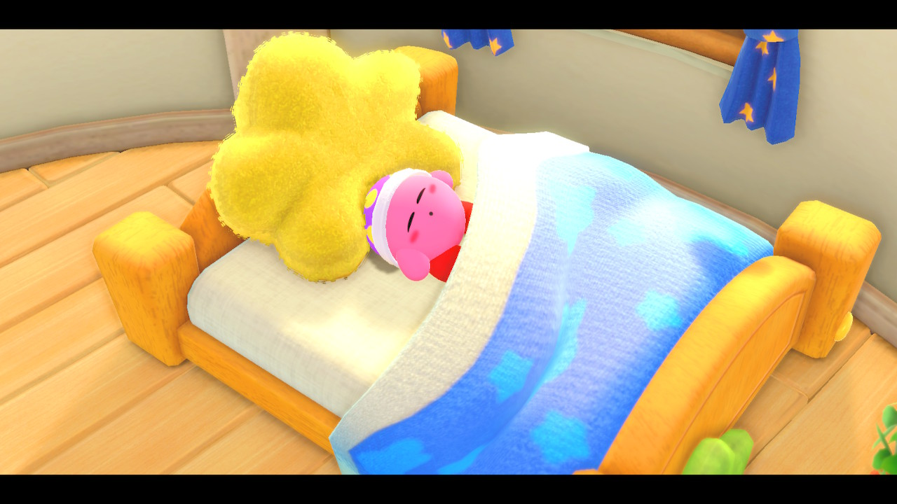
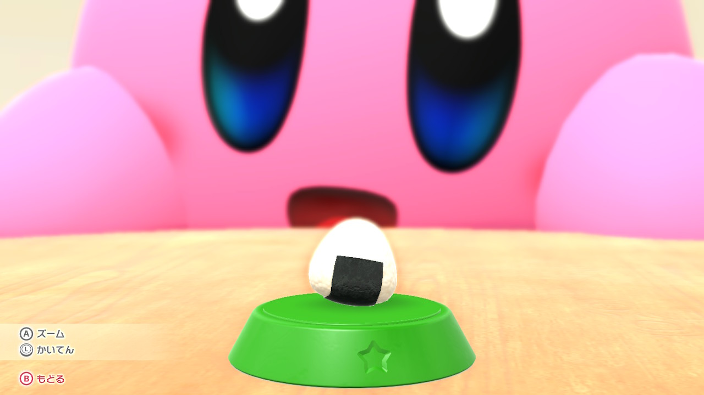
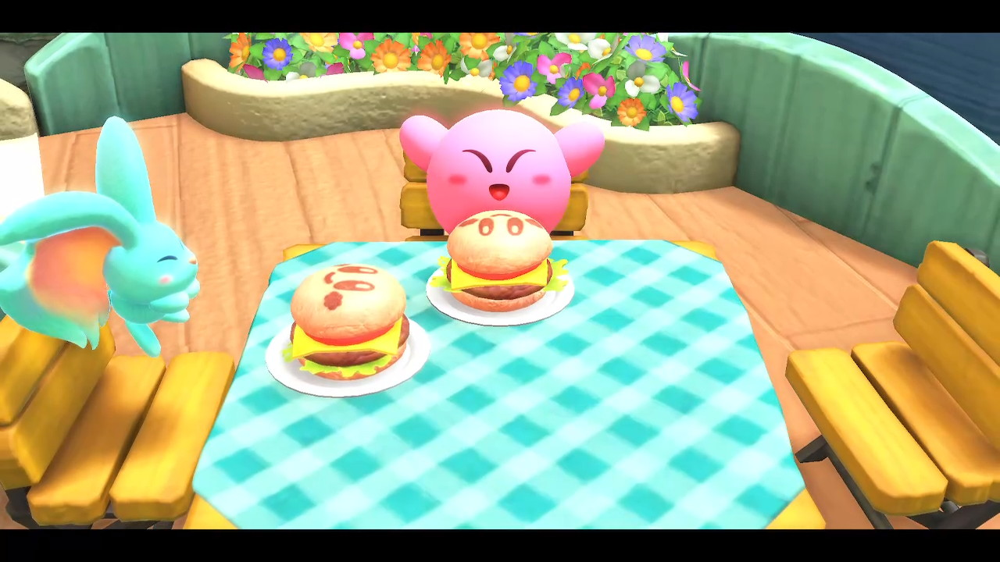
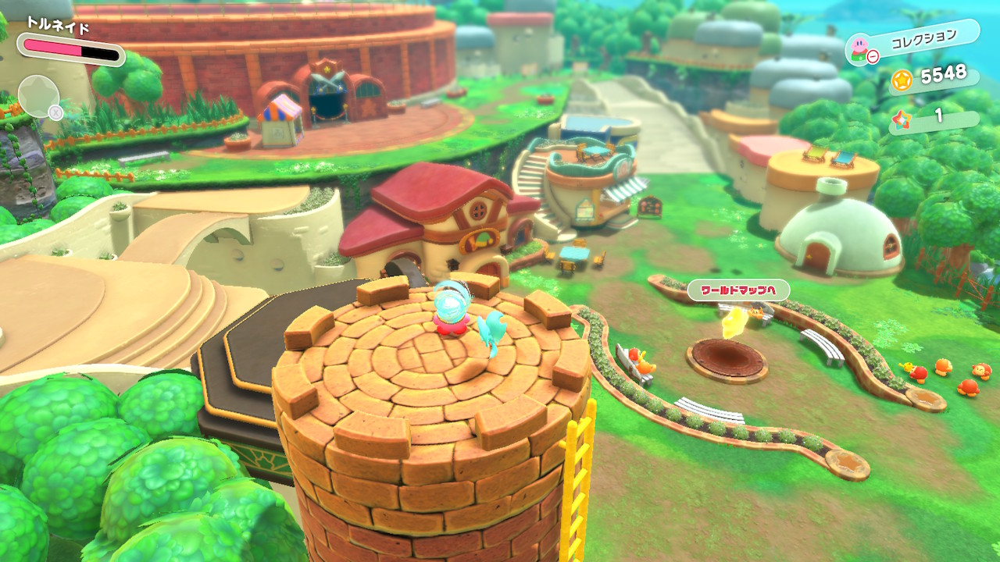
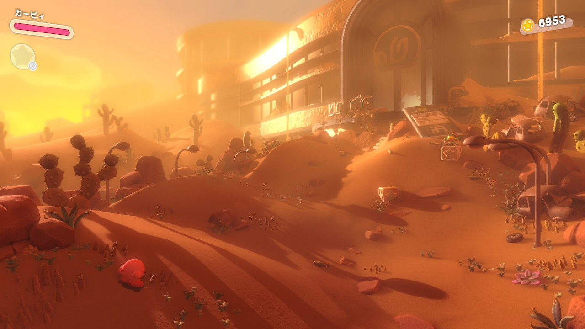
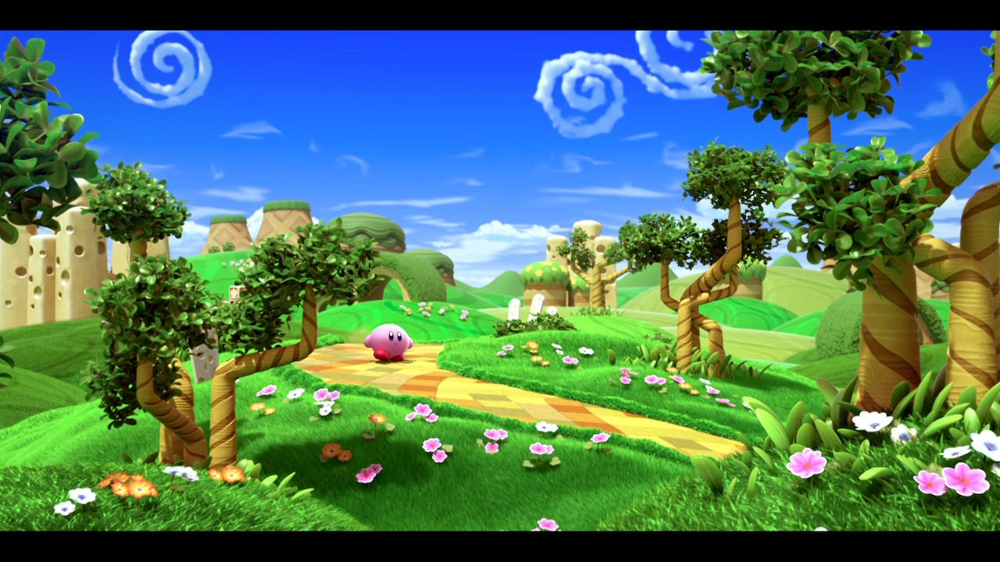
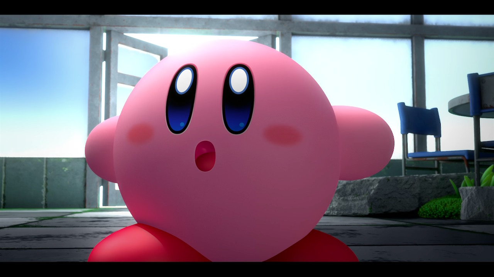

これは [.ごっ！のアドベントカレンダー](https://adventar.org/calendars/8199) の8日目の記事です。

こんにちは、.ごっちです。

2022年3月末に発売された「星のカービィ　ディスカバリー」をプレイしてとても楽しかった記憶しかないので、その記憶を書きます。

<blockquote class="twitter-tweet">
たのしー！！！！ <a href="https://twitter.com/hashtag/%E6%98%9F%E3%81%AE%E3%82%AB%E3%83%BC%E3%83%93%E3%82%A3%E3%83%87%E3%82%A3%E3%82%B9%E3%82%AB%E3%83%90%E3%83%AA%E3%83%BC?src=hash&amp;ref_src=twsrc%5Etfw">#星のカービィディスカバリー</a> <a href="https://twitter.com/hashtag/NintendoSwitch?src=hash&amp;ref_src=twsrc%5Etfw">#NintendoSwitch</a> <a href="https://t.co/Mjwub9Gr4o">pic.twitter.com/Mjwub9Gr4o</a>
&mdash; .ごっち (@gggooottto) <a href="https://twitter.com/gggooottto/status/1507351012264214528?ref_src=twsrc%5Etfw">March 25, 2022</a></blockquote>

## とにかくかわいい

表情どれを切り取ってもカービィらしくとてもかわいいです。プレイしていて癒されるし、いくらでも見ていられます。とても好き。

## 操作性がいい

今までのカービィにはない奥に行くことができるゲームなので、下入力で飲み込む（コピー能力を取得する）ことができなくなったことには違和感を感じましたが、自動飲み込みかボタンで飲み込みかを選択でき問題なく遊べました。

奥にいる敵キャラとの距離がわからなく ぶつかることがほぼなかったです。コピー能力の射程がどのくらいあるのかわからないとき、こちらの攻撃を相手に当てられないことはよくありました。

## ストーリー

プププランドから新世界にぶっ飛ばされたあと、捕らわれたワドルディを見つけては救い出す というストーリーでいたってシンプルでわかりやすいです。（新世界に飛ばされてしまう理由については覚えていません...）

荒廃したステージを縦横無尽に探索するのはとてもいいです。最近のゲームはわりと荒廃したものが多い気がしますが気のせいでしょう。

ストーリー終盤にあるムービーのワドルディの扱いがすごいなぁとは思いました。ビースト軍団はブラック企業だったのかもしれない。

---

星のカービィ Wii デラックスが来年2月末に発売される予定なので、そこまでにもう一周したいなーと思ってます。カービィWiiもたのしみ！

<blockquote class="twitter-tweet">
楽しかった！！！！！ <a href="https://twitter.com/hashtag/%E6%98%9F%E3%81%AE%E3%82%AB%E3%83%BC%E3%83%93%E3%82%A3%E3%83%87%E3%82%A3%E3%82%B9%E3%82%AB%E3%83%90%E3%83%AA%E3%83%BC?src=hash&amp;ref_src=twsrc%5Etfw">#星のカービィディスカバリー</a> <a href="https://twitter.com/hashtag/NintendoSwitch?src=hash&amp;ref_src=twsrc%5Etfw">#NintendoSwitch</a> <a href="https://t.co/rIsoUVBts9">pic.twitter.com/rIsoUVBts9</a>
&mdash; .ごっち (@gggooottto) <a href="https://twitter.com/gggooottto/status/1526871756073381888?ref_src=twsrc%5Etfw">May 18, 2022</a></blockquote>
