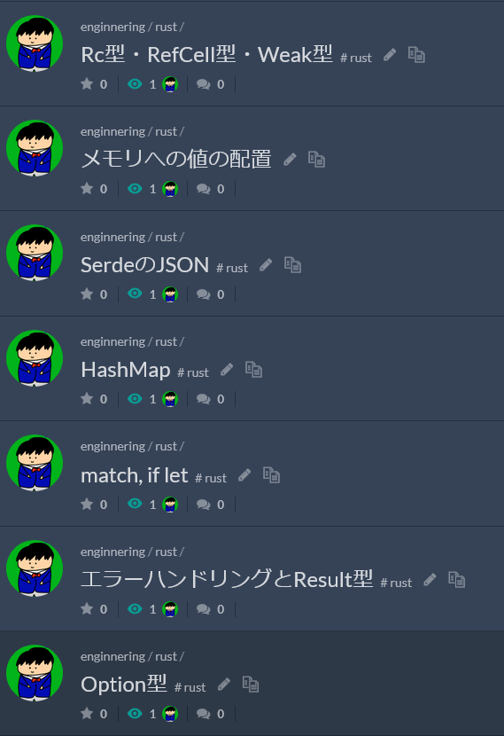

これは [.ごっ！のアドベントカレンダー](https://adventar.org/calendars/8199) の17日目の記事です。

こんにちは、.ごっちです。

ずっと気になっている言語であったので、腰をいれてRust言語を自習しています。

以前にはCLIコマンドを作りましたが、本を読み終わるころにはそれなりなコードをかけると信じています。

- GitHub ActionsのStatus Badgeをよしなに作るコマンドを作った: https://yutagoto.github.io/blog/20220514-gha-badge/

<blockquote class="twitter-tweet">
コンセプトから理解できるようになりたい <a href="https://t.co/9WlyQ4RKz1">pic.twitter.com/9WlyQ4RKz1</a>
&mdash; .ごっち (@gggooottto) <a href="https://twitter.com/gggooottto/status/1519593752939364352?ref_src=twsrc%5Etfw">April 28, 2022</a></blockquote>

## コンセプトから理解するRust

写経しながら進めています。esaに要所要所まとめています。

といいつつもあと3分の1くらい残っているのでまだかかりそうです。年内には読破したいと考えてます。

具体的なコードの理解はOSSを見たほうがよさそうとは思っていますが、そもそもを理解していないと何もわからないので、本を読み切ることを優先しています。

## 環境まわり

CLIコマンドをRustで再実装したツールがいくつかあるので、それらを使うように置き換えました。

- exa is a modern replacement for ls.: https://github.com/ogham/exa
- A cat(1) clone with wings. : https://github.com/sharkdp/bat

ターミナルも [Warp](https://www.warp.dev/) にしたいところですが、Windows版が開発中とのことで待っています。
[Starship](https://starship.rs/)を時間があるときに溜めそうかと思っています。

## 今後

Rustで結構いろいろしていこうとは考えてます。

AtCoderのHeuristic Contestに参加するときはRustでじっくり書きたい所存です（ABC, ARCはスピードもそれなりに求められるので書きなれているPythonやRubyでコーディングするつもりです）。

仕事でRustを書いていくのは現状の形態では厳しいと感じていますが、趣味プロダクトで小さく活用していきたい気持ちはあります。

ゲームエンジンもあるのでこれもチュートリアルくらいは触ってみたいです。

- Bevy: https://bevyengine.org/learn/book/introduction/
